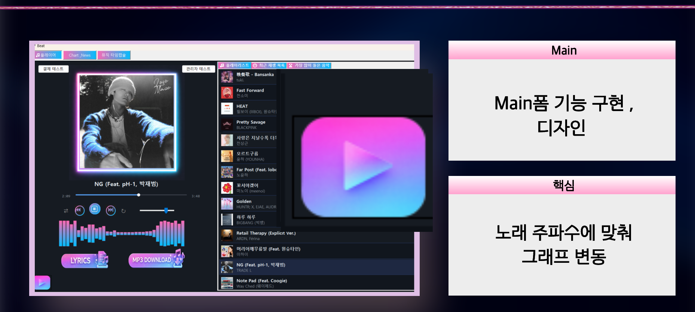
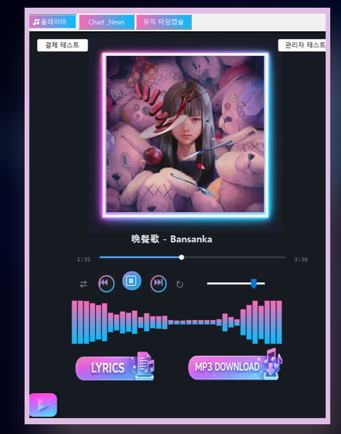
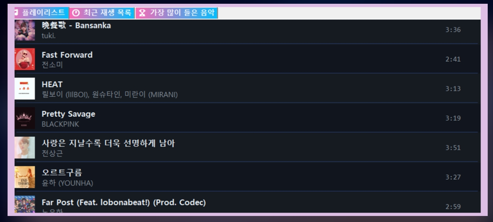
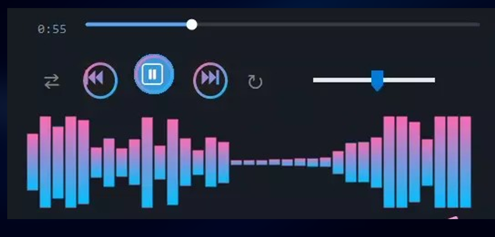
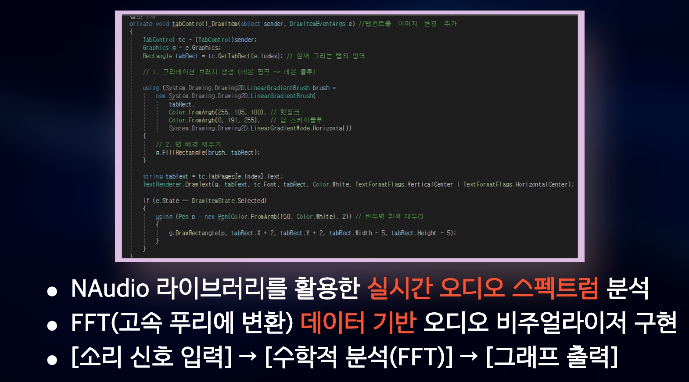
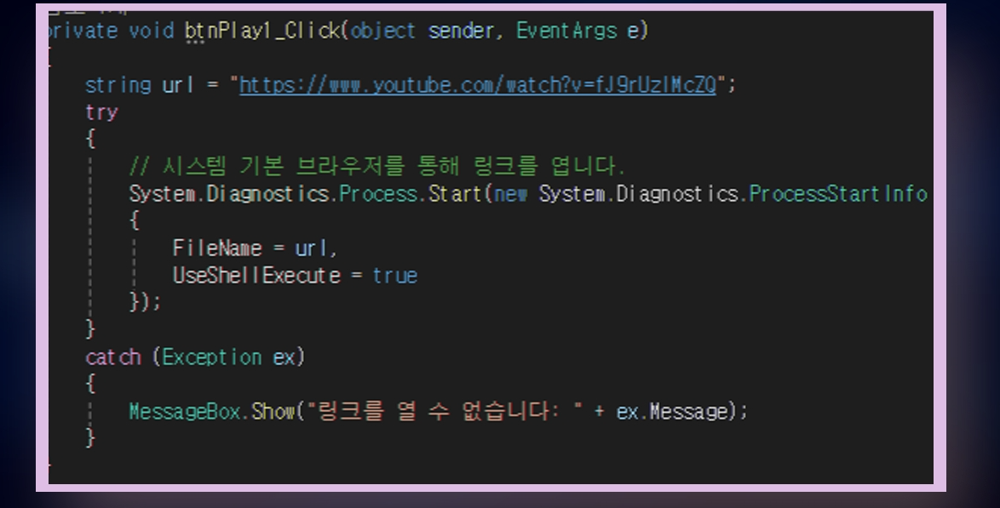

# C# WinForm 음악 플레이어 및 실시간 오디오 시각화

C# Windows Forms를 이용해 음악 재생, 재생목록 확인, 볼륨 조절 및 실시간 주파수 그래프 기능을 구현한 팀 프로젝트입니다.

NAudio로 재생 중인 오디오 데이터를 가져오고 FFT를 적용하여, 음악의 주파수 변화가 막대그래프로 실시간 표시되도록 구현했습니다.

| 구분 | 내용 |
|---|---|
| 수행 기간 | 2026.03.05 ~ 2026.03.17 |
| 인원 | 5명 |
| 담당 역할 | 메인 음악 플레이어, 재생목록 UI 및 실시간 오디오 그래프 구현 |
| 개발 환경 | C#, Windows Forms, Visual Studio 2022, NAudio, FFT |

[▶ 프로젝트 동작 영상 보기](https://youtu.be/aTRpC3563vI?si=xxDGgyIasboEVMI4)

---

## 프로젝트 소개

사용자가 재생목록에서 음악을 선택하면 앨범 이미지와 곡 정보가 메인 화면에 표시되고 음악이 재생됩니다.

재생, 일시정지, 이전 곡, 다음 곡, 볼륨 조절 및 재생 위치 변경 기능을 구현했으며, 재생 중인 오디오 데이터를 분석해 주파수 변화가 막대그래프로 움직이도록 만들었습니다.

팀 프로젝트 전체에는 로그인, 회원가입, 음악 차트, 뉴스 및 관리자 기능이 포함되어 있으며, 이 저장소는 제가 담당한 메인 음악 플레이어와 오디오 시각화 기능을 중심으로 정리했습니다.

---

## 메인 화면

음악 플레이어와 재생목록, 최근 재생 목록 및 많이 들은 음악을 한 화면에서 확인할 수 있도록 구성했습니다.



---

## 음악 재생 화면

앨범 이미지, 노래 제목, 재생 바, 재생 버튼과 볼륨 조절 기능을 배치했습니다.

- 음악 재생 및 일시정지
- 이전 곡 및 다음 곡 이동
- 반복 재생
- 재생 위치 확인 및 변경
- 볼륨 조절
- 실시간 주파수 그래프 출력



---

## 음악 재생목록

음악 제목, 가수, 앨범 이미지와 재생 시간을 목록으로 표시했습니다.

현재 선택된 음악의 배경색을 다르게 표시하여 사용자가 재생 중인 곡을 쉽게 확인할 수 있도록 구성했습니다.



---

## 실시간 오디오 그래프

NAudio를 이용해 재생 중인 음악의 샘플 데이터를 받아오고, FFT를 이용해 주파수 값으로 변환했습니다.

변환된 값의 크기에 따라 막대 높이가 달라지도록 하여, 음악이 재생되는 동안 그래프가 계속 움직이도록 구현했습니다.

```text
음악 재생
    ↓
NAudio로 오디오 샘플 수집
    ↓
FFT를 이용해 주파수 값으로 변환
    ↓
주파수 값에 따라 그래프 높이 변경
```



### 오디오 그래프 구현 코드



---

## 유튜브 링크 기능

버튼을 누르면 설정된 유튜브 링크가 기본 브라우저에서 열리도록 구현했습니다.

링크 실행 중 오류가 발생하면 메시지 창으로 오류 내용을 표시하도록 예외 처리했습니다.



---

## 주요 구현 기능

| 기능 | 설명 |
|---|---|
| 음악 재생 | 선택한 음악 파일 재생 |
| 재생 및 일시정지 | 버튼을 이용한 재생 상태 변경 |
| 이전 곡 및 다음 곡 | 재생목록의 곡 이동 |
| 볼륨 조절 | 슬라이더를 이용한 음량 변경 |
| 재생 위치 변경 | 재생 바를 이용해 원하는 구간으로 이동 |
| 재생목록 | 곡 제목, 가수, 앨범 이미지와 재생 시간 표시 |
| 실시간 그래프 | FFT 결과에 따라 막대그래프 높이 변경 |
| 유튜브 링크 | 버튼 클릭 시 기본 브라우저로 링크 실행 |
| UI 디자인 | 버튼, 탭, 배경과 테두리 디자인 적용 |

---

## 소스 코드

| 파일 | 내용 |
|---|---|
| [`MainForm.cs`](./MainForm.cs) | 플레이어 상태, NAudio 객체, FFT 버퍼 및 메인 화면 초기화 |
| [`mainform.playlist.cs`](./mainform.playlist.cs) | 재생목록 불러오기, 곡 목록 출력 및 선택 상태 표시 |
| [`Mainform.Extrea.cs`](./Mainform.Extrea.cs) | 버튼·탭 디자인, 음악 차트·뉴스 화면 및 외부 링크 기능 |

---

## 내가 맡은 부분

- 메인 음악 플레이어 화면 제작
- 음악 재생 및 일시정지 기능 구현
- 이전 곡과 다음 곡 이동 기능 구현
- 재생 위치 및 볼륨 조절 기능 구현
- NAudio를 이용한 오디오 데이터 처리
- FFT를 이용한 주파수 값 계산
- 주파수 값에 따라 움직이는 막대그래프 구현
- 재생목록 UI 구성과 선택 항목 표시
- 버튼, 탭, 테두리 및 배경 디자인
- 유튜브 링크 버튼과 오류 처리 기능 구현
- 프로젝트 발표자료 제작 및 구현 내용 정리

---

## 저장소 구성

```text
mp3-media-player
├── MainForm.cs
├── Mainform.Extrea.cs
├── mainform.playlist.cs
├── README.md
└── docs
    └── images
        ├── main_screen.png
        ├── player_screen.png
        ├── playlist.png
        ├── audio_spectrum.png
        ├── audio_spectrum_code.png
        └── youtube_link_code.png
```
